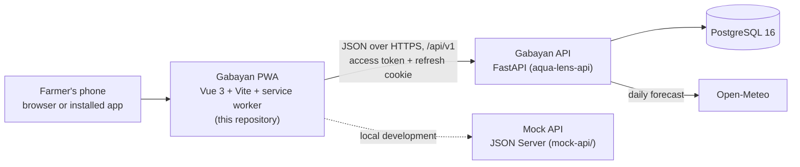

# Gabayan

**Your guide to better fish farming.** Gabayan is a mobile-first progressive web app (PWA) that
walks beginner and small-scale fish farmers in the Philippines through a whole cultivation - from
planning a pond, cage or tank, to stocking, daily care, record keeping and harvest - with calm,
plain-language guidance and a small marketplace for the tools and feed that each stage needs.

_Gabayan_ comes from _gabay_, the Filipino word for "guide".

This repository holds the Vue 3 PWA and its development mock API. The production backend is the
FastAPI service in the separate [`aqua-lens-api`](#repositories) repository.

- **New here?** Read [What Gabayan does](#what-gabayan-does), then the
  [Quick start](#quick-start).
- **Setting it up** on your machine or online: [docs/guides/setup_guide.md](docs/guides/setup_guide.md).
- **Presenting it:** [docs/guides/demo_guide.md](docs/guides/demo_guide.md) has the demo script and every
  account you need.

## Contents

- [The problem](#the-problem)
- [What Gabayan does](#what-gabayan-does)
- [Plans](#plans)
- [Honest guidance](#honest-guidance)
- [Built for the field](#built-for-the-field)
- [How it is built](#how-it-is-built)
- [Repositories](#repositories)
- [Quick start](#quick-start)
- [Documentation](#documentation)
- [Project status](#project-status)

## The problem

Most small fish farms in the Philippines are run on experience and guesswork. A single bad night
can wipe out a crop, and feed - the biggest cost - is easy to waste. The team's product brief
names five recurring causes of loss:

| Problem                       | What happens                                                                                                                                                       | Source                                                                                                                                                               |
| ----------------------------- | ------------------------------------------------------------------------------------------------------------------------------------------------------------------ | -------------------------------------------------------------------------------------------------------------------------------------------------------------------- |
| Low dissolved oxygen          | Uneaten feed and waste rot at the bottom and use up oxygen. Below about 2-3 mg/L fish gasp at the surface ("piping") and can die overnight.                        | [UF/IFAS FA002](https://ask.ifas.ufl.edu/publication/FA002)                                                                                                          |
| Heat and water temperature    | Warm water holds less oxygen while fish breathe and digest faster. Shallow water and unchanged feeding during hot spells cause thermal stress.                     | [Fondriest](https://www.fondriest.com/environmental-measurements/parameters/water-quality/dissolved-oxygen/)                                                         |
| Algae blooms                  | Nutrients from waste and feed trigger blooms; when the algae die off, decomposition strips oxygen from the water.                                                  | [US EPA](https://www.epa.gov/ms-htf/hypoxia-101)                                                                                                                     |
| Overstocking and handling     | Too many fish for the space, and rough handling on stocking day, raise early mortality and skew the farm's count from the start.                                   | [ResearchGate study](https://www.researchgate.net/publication/402132610_The_Effect_of_Stocking_Density_on_Fish_Growth_and_Survival_in_Intensive_Cultivation_Systems) |
| Feed cost and feed conversion | Commercial feed is 50-70 % or more of operating cost for bangus and tilapia. Feeding by eye inflates the feed conversion ratio (FCR) and eats the season's margin. | [SEAFDEC/AQD](https://www.seafdec.org.ph/development-of-cost-efficient-feeds/)                                                                                       |

Gabayan's answer is not a textbook. It is a daily companion that tells a farmer what to do next,
why, and how sure the advice is.

## What Gabayan does

The app follows a cultivation from the first question to the harvest. Each stage below is a
working screen or flow in the current build.

### 1. Plan - the cultivation setup wizard

A new farmer creates an account, picks a plan, and is guided through five steps:

1. **Species** - Tilapia, Milkfish (Bangus), Catfish (Hito), Grouper (Lapu-lapu), Shrimp (Hipon)
   and Carp, each with its own rules.
2. **Culture environment** - pond, tank/container or fish cage, with a compatibility check: a
   combination that does not suit the species (for example shrimp in a floating cage) is advised
   against and a better environment is suggested.
3. **Good water for your stock** - suggested ranges for the seven water parameters (salinity, pH,
   ammonia, nitrite, nitrate, dissolved oxygen and water temperature), each with a plain
   explanation.
4. **Measure your culture area** - length, width and depth, with a pop-up of the suggested pond or
   cage size and depth for the chosen fish (for example about 5,000 m² at 1.0-1.2 m for 5,000
   bangus).
5. **Fingerlings** - a stocking estimate that says whether the planned number is below, within or
   above the recommended range, and how much extra space an above-range plan would need. Going
   above the range requires an explicit acknowledgement.

The farmer reviews the plan and creates the cultivation. The success screen recommends the
equipment the setup needs, each with a **Buy now** button.

### 2. Grow - daily guidance and records

- **Home** shows the featured cultivation, today's tasks with progress, a farm overview, a
  learning tip, a weather card and the unread-notification count.
- **Daily tasks** - feeding tasks come with the planned amount from the day's feeding plan;
  completing one records the feeding in the same step. Water-condition checks are tasks too.
- **Cultivation detail** - estimated live fish, days since stocking, stock and feeding summaries,
  the estimated harvest window, and a timeline of everything that happened.
- **Farm records** - feeding records, mortality (which updates the estimated live fish), and
  water observations that return conditional guidance when something unusual is noticed.
- **Growth** - sample weights with a growth chart; each sample updates the stage and the feeding
  plan.
- **Feed plan and feed guide** - the feed for the current growth stage (type, protein, pellet
  size, feedings a day) and the species' whole feed guide, with **Buy now** to the matching feed.
- **Water safety check** - type in any readings and see each one as within, below or above its
  suggested range, with what to do and products that may help (for example an aerator for low
  oxygen).
- **Water log** _(Pro)_ - saved readings with history and a per-parameter trend.
- **Feed conversion** _(Pro)_ - the feed conversion ratio worked out from the feeding, growth and
  mortality records, with the basis shown.

### 3. Stay on schedule - reminders and alerts

- **Feeding reminders** at the farmer's morning and afternoon feeding times.
- **Partial water-change reminders** - about 30 % at a time, never a full water replacement.
- **Harvest alerts** - only when a _current_ sample reaches the target weight; the usual 120-150
  days is shown as a hint, and the decision stays with the grower.
- **Weather alerts** - hot-day and cloudy-spell warnings from a daily forecast for the farm's
  municipality and province, with what the weather means for the fish.
- A **notification centre** with filters and links straight to the task or screen, and
  **preferences** to switch each reminder type on or off.

### 4. Harvest

Harvest readiness is judged from a recent growth sample, never from elapsed days alone. When the
fish are ready, the farmer records the harvest (count, total weight, average weight, selling
price) and gets an auditable summary with the survival rate and estimated revenue; the cultivation
moves to the completed list.

### 5. Buy what the farm needs

A marketplace sells setup tools, water-testing kits, feed and supplies. Products explain **why
they may help**, carry an **installation guide** where one applies, and are reached in context -
from a setup recommendation, a low water reading or the feed plan - so the shop supports the
cultivation instead of competing with it. The cart and checkout are priced by the server; cash on
delivery is available (GCash and cards are shown as coming soon). Orders have a tracking timeline.

### 6. Account

Personal details, a farm profile (whose location drives the weather alerts), delivery addresses,
reminder preferences, and the current plan with its culture-system usage.

## Plans

Every account starts on **Free**. There is no in-app payment yet: a farmer requests a higher plan
in the app, and an operator approves it (see the
[demo guide](docs/guides/demo_guide.md#operator-commands)).

| Plan         | Culture systems | Price shown in the app | Includes                                                                                                         |
| ------------ | --------------: | ---------------------- | ---------------------------------------------------------------------------------------------------------------- |
| Free         |               1 | ₱0 / month             | Daily guidance and records, pond size and stocking calculator, marketplace, water guideline ranges, safety check |
| Pro          |              10 | Pricing coming soon    | Everything in Free, plus saved water readings with history and feed conversion tracking                          |
| Organization |             100 | ₱4,999 / month         | Everything in Pro, for cooperatives, companies and government programmes that manage many culture systems        |

A harvested cultivation no longer counts toward the limit. Pro-only screens send a Free farmer to
the plans page, and the API refuses the same requests, so the limit cannot be bypassed from the
browser.

## Honest guidance

Gabayan deals with living animals and people's income, so it is careful about what it claims:

- **Every figure is labelled.** Stocking ranges, feed rates, water ranges, sizing, harvest targets
  and weather thresholds are _demo_ values until a qualified source reviews them. Each
  recommendation carries its provenance (`isDemo`, `sourceStatus`, `ruleVersion`, `basis`) and a
  visible disclaimer.
- **Rules belong to species and culture systems**, stored as data - not one rule for every fish.
- **No full water replacement advice.** Water changes are partial and configurable per species and
  system.
- **Harvest needs a measurement.** Elapsed days are only a hint.
- **The marketplace never takes over.** It appears where a cultivation needs something, and the
  bottom navigation keeps exactly four destinations: Home, Cultivations, Orders and Profile.

## Built for the field

- **Mobile first** - designed at 390 × 844 px and checked from 320 to 430 px wide.
- **Installable PWA** - web manifest, service worker, and an update prompt when a new version is
  deployed.
- **Honest offline behaviour** - the last synced data stays readable with an offline banner;
  high-impact writes (orders, records, harvest) are disabled offline instead of silently queued.
- **Accessible** - visible labels, 44 px minimum touch targets, statuses that combine text, icon
  and colour, keyboard skip links and reduced-motion support.
- **Local conventions** - Philippine peso stored as integer centavos, metric units, and
  `Asia/Manila` as the display time zone.

## How it is built



- **One HTTP contract.** [docs/api_contract.md](docs/api_contract.md) defines every path, payload,
  envelope and error. The PWA, the mock and the FastAPI service all follow it, so switching the
  app from the mock to FastAPI is a single setting: `VITE_API_BASE_URL`.
- **Server-owned results.** Stocking estimates, feeding plans, readiness, totals, reminders and
  alerts are worked out by the API; the app never calculates money or biology on its own.
- **Safe writes.** Orders and farm records carry an `Idempotency-Key`, so a retried request never
  creates a duplicate; edits carry a version (`If-Match`) so a stale screen cannot overwrite newer
  data.

| Layer             | Technology                                                                                          |
| ----------------- | --------------------------------------------------------------------------------------------------- |
| App framework     | Vue 3 (Composition API, `<script setup>`), TypeScript (strict), Vite                                |
| Routing and state | Vue Router, Pinia (session and short-lived UI state), TanStack Query (server state)                 |
| API boundary      | `fetch` with Zod schemas validating every response                                                  |
| PWA               | `vite-plugin-pwa` with Workbox (precached shell, network-first data caches)                         |
| Development API   | JSON Server behind a custom Node server (`mock-api/server.mjs`) with a deterministic seed           |
| Production API    | FastAPI, SQLAlchemy 2 (async), Alembic, PostgreSQL 16 - see the `aqua-lens-api` repository          |
| Tests             | Vitest and Vue Test Utils (unit, component), a contract suite, Playwright (mobile browser journeys) |
| Tooling           | pnpm, ESLint (including an import-boundary rule for `.vue` files), Prettier                         |

The source is organised by feature under `src/pages/<feature>/` with `data/`, `domain/` and
`presentation/` layers; [docs/guides/development_guide.md](docs/guides/development_guide.md#source-layout)
explains the layout and its rules.

## Repositories

Gabayan is two repositories that are checked out side by side:

```text
<workspace>/
|-- gabayan_pwa/     this repository - the PWA, the mock API and the API contract
`-- aqua-lens-api/   the FastAPI backend and its PostgreSQL schema
```

| Repository      | Remote                                      | Contents                                                     |
| --------------- | ------------------------------------------- | ------------------------------------------------------------ |
| `gabayan_pwa`   | https://github.com/panzerweb/gabayan_pwa    | Vue PWA, JSON Server mock, API contract, product docs, tests |
| `aqua-lens-api` | https://gitlab.com/donenargan/aqua-lens-api | FastAPI service, Alembic migrations, demo-data CLI, tests    |

Keep the folder names as shown: the API's test suite checks the API against
`../gabayan_pwa/docs/api_contract.md`, and skips those checks when the folder is missing.

## Quick start

The fastest way to see Gabayan is the PWA with its mock API - it needs only Node.js 24+ and
pnpm 11+.

```powershell
git clone https://github.com/panzerweb/gabayan_pwa.git
cd gabayan_pwa
Copy-Item .env.example .env      # macOS/Linux: cp .env.example .env
pnpm install
pnpm mock:reset
pnpm dev:all
```

Open http://localhost:5173 and sign in as the demo farmer:

- Email: `juan@example.com`
- Password: `Gabayan123!`

Use your browser's device toolbar (390 × 844) for the intended phone layout. To run the full stack
with FastAPI and PostgreSQL, or to deploy Gabayan online, follow the
[setup guide](docs/guides/setup_guide.md).

## Documentation

| Document                                                             | What it covers                                                                            |
| -------------------------------------------------------------------- | ----------------------------------------------------------------------------------------- |
| [docs/guides/setup_guide.md](docs/guides/setup_guide.md)             | Local setup (mock or full stack), phone testing, online deployment, configuration, fixes  |
| [docs/guides/demo_guide.md](docs/guides/demo_guide.md)               | Demo accounts, preparation checklist, scene-by-scene script, operator commands, resetting |
| [docs/guides/development_guide.md](docs/guides/development_guide.md) | Quality checks, contract suite, running the suites against FastAPI, source layout         |
| [docs/api_contract.md](docs/api_contract.md)                         | The canonical v1 HTTP contract shared by the PWA, the mock and FastAPI                    |
| [docs/implementation_plan.md](docs/implementation_plan.md)           | Scope, experience architecture, routes, delivery phases and open decisions                |
| [docs/release_checklist.md](docs/release_checklist.md)               | The release gate and what remains before a public launch                                  |
| [AGENTS.md](AGENTS.md)                                               | Product rules and engineering conventions for anyone changing the code                    |

## Project status

**Built:** every flow described above, on both the mock API and the FastAPI backend - accounts and
sessions, the setup wizard for six species, daily tasks and records, reminders, weather alerts,
water-quality tools, Pro water logs and feed conversion, harvest, the marketplace, orders and
tracking, profiles and plans. The app is an installable, offline-aware PWA with unit, component,
contract and browser-journey tests.

**Not yet in place** (tracked in the [implementation plan](docs/implementation_plan.md#13-open-decisions)
and the [release checklist](docs/release_checklist.md)):

- **Verified biology.** All aquaculture figures are demo values awaiting review by a qualified
  source.
- **Payments and delivery.** Checkout supports cash on delivery only; there is no payment gateway
  or courier integration, and an operator moves orders along by hand.
- **Plan billing.** Upgrades are requested in the app and approved by an operator.
- **Email and Google sign-in.** Password-reset links are written to the API's log instead of
  being emailed, and the "Continue with Google (demo)" button works only against the mock.
- **Push notifications.** Reminders and alerts are in-app; they are raised when the farmer opens
  Home or the notifications.
- **Filipino and regional languages.** The interface is English-first.
- **Field checks.** Screen-reader, 200 % text-size and physical-device installation checks are
  still to be repeated on the final deployment.
