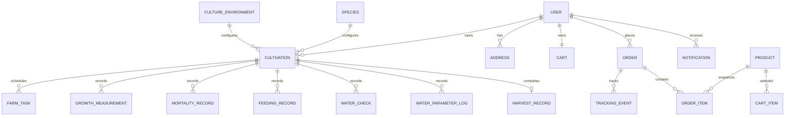

# Gabayan API Contract

## 1. Purpose and Status

This document is the canonical HTTP contract shared by:

- the Vue PWA;
- the JSON Server-based development API; and
- the future FastAPI production backend.

Status: proposed v1 contract. Implement the mock and frontend against this contract first. The future FastAPI service may use different persistence/domain internals, but it must preserve these public paths and JSON shapes or publish a versioned migration.

Aquaculture values in the mock are demo values. A rule becomes production-trusted only when `sourceStatus` is `VERIFIED` and its source metadata has passed product/domain review.

## 2. Transport Conventions

### Base URLs

```text
Development: http://localhost:3001/api/v1
Production:  ${VITE_API_BASE_URL}/api/v1
```

If `VITE_API_BASE_URL` already contains `/api/v1`, the client must not append it again. Choose one environment convention during scaffolding and enforce it in environment validation. Recommended: store the full API root, including `/api/v1`.

### General rules

| Concern          | Contract                                                                   |
| ---------------- | -------------------------------------------------------------------------- |
| Encoding         | UTF-8 JSON; `Content-Type: application/json`                               |
| Wire naming      | `camelCase`                                                                |
| IDs              | Opaque strings; UUID-compatible but never parsed by clients                |
| Timestamps       | RFC 3339 UTC strings, e.g. `2026-09-21T08:00:00Z`                          |
| Calendar dates   | `YYYY-MM-DD`                                                               |
| Display timezone | Client defaults to `Asia/Manila`                                           |
| Currency         | Integer minor units plus ISO currency; PHP centavos                        |
| Measurements     | Numeric value plus explicit unit, or fields whose unit is in the name      |
| Authentication   | `Authorization: Bearer <accessToken>` unless marked Public                 |
| Refresh          | Secure HttpOnly refresh cookie in production; simulated cookie in mock     |
| Idempotency      | `Idempotency-Key` header on order creation and high-impact record creation |
| Correlation      | Optional `X-Request-Id`; server returns/generates `requestId`              |

Do not use formatted strings such as `"₱1,299"`, `"30 m³"`, or `"Feb 20"` as model values. Formatting belongs to the client.

### Success envelopes

Single resource:

```json
{
  "data": {},
  "meta": {
    "requestId": "req_01K..."
  }
}
```

Collection:

```json
{
  "data": [],
  "page": {
    "cursor": null,
    "nextCursor": null,
    "limit": 20,
    "total": 0
  },
  "meta": {
    "requestId": "req_01K..."
  }
}
```

Mutation endpoints return the updated/created resource unless the endpoint explicitly returns `204 No Content`.

### Error envelope

```json
{
  "error": {
    "code": "VALIDATION_ERROR",
    "message": "Enter dimensions greater than zero.",
    "fields": {
      "waterDepthM": ["Must be greater than 0."]
    },
    "details": null,
    "requestId": "req_01K..."
  }
}
```

Stable error codes:

| HTTP | Codes                                                                             |
| ---- | --------------------------------------------------------------------------------- |
| 400  | `BAD_REQUEST`, `INCOMPATIBLE_SELECTION`, `RULE_INPUT_INCOMPLETE`                  |
| 401  | `AUTH_REQUIRED`, `INVALID_CREDENTIALS`, `TOKEN_EXPIRED`                           |
| 403  | `FORBIDDEN`, `EMAIL_NOT_VERIFIED`, `TIER_LIMIT_REACHED`                           |
| 404  | `NOT_FOUND`                                                                       |
| 409  | `CONFLICT`, `DUPLICATE_EMAIL`, `IDEMPOTENCY_CONFLICT`, `INVALID_STATE_TRANSITION` |
| 422  | `VALIDATION_ERROR`                                                                |
| 429  | `RATE_LIMITED`                                                                    |
| 500  | `INTERNAL_ERROR`, `CALCULATION_ERROR`                                             |
| 503  | `SERVICE_UNAVAILABLE`                                                             |

Validation paths use request JSON field names. The mock must not expose JSON Server/Express internals; FastAPI must translate default validation output into this envelope.

### Pagination, filter, and sort

- Cursor parameters: `cursor`, `limit` (default 20, maximum 100).
- Multi-value filters repeat the key: `status=ACTIVE&status=PRE_HARVEST`.
- Search uses `search` and is case-insensitive in the mock.
- Sort uses `sort=<field>` and `order=asc|desc`; each endpoint lists allowed sort fields.
- Unknown filters/sorts return `400 BAD_REQUEST` rather than silently changing behavior.

### Conditional and stale writes

Mutable resources expose integer `version`. Update requests may send `If-Match: <version>`. A stale version returns `409 CONFLICT` with the latest version in `details.currentVersion`. The mock should support this for cultivation/profile/cart settings where practical.

## 3. Resource Relationships



## 4. Shared Types and Enums

### Primitive value objects

#### Money

| Field         | Type        | Required | Rules                    |
| ------------- | ----------- | -------: | ------------------------ |
| `amountMinor` | integer     |      yes | `>= 0`; centavos for PHP |
| `currency`    | string enum |      yes | `PHP` in v1              |

#### Quantity

| Field   | Type   | Required | Rules                                                     |
| ------- | ------ | -------: | --------------------------------------------------------- |
| `value` | number |      yes | finite; domain endpoint sets min/max                      |
| `unit`  | enum   |      yes | `G`, `KG`, `M`, `M2`, `M3`, `CELSIUS`, `COUNT`, `PERCENT` |

#### MediaAsset

| Field    | Type    | Required | Rules                                                            |
| -------- | ------- | -------: | ---------------------------------------------------------------- |
| `url`    | string  |      yes | HTTPS in production; local path allowed in mock                  |
| `alt`    | string  |      yes | Useful, non-decorative description or empty for decorative image |
| `width`  | integer |       no | Pixels, positive                                                 |
| `height` | integer |       no | Pixels, positive                                                 |

#### AuditFields

`createdAt`, `updatedAt` are RFC 3339 timestamps. Mutable resources also contain integer `version >= 1`.

### Enums

| Name                     | Values                                                                                                                                                               |
| ------------------------ | -------------------------------------------------------------------------------------------------------------------------------------------------------------------- |
| `SourceStatus`           | `DEMO`, `DRAFT`, `VERIFIED`, `RETIRED`                                                                                                                               |
| `CompatibilityStatus`    | `COMPATIBLE`, `CAUTION`, `NOT_RECOMMENDED`                                                                                                                           |
| `StockingResultStatus`   | `BELOW_RANGE`, `RECOMMENDED`, `ABOVE_RANGE`                                                                                                                          |
| `CultivationStatus`      | `PLANNING`, `ACTIVE`, `GROWING`, `PRE_HARVEST`, `COMPLETED`, `CANCELLED`                                                                                             |
| `TaskType`               | `FEEDING`, `WATER_CHECK`, `WATER_MAINTENANCE`, `EQUIPMENT_INSPECTION`, `GROWTH_SAMPLING`, `CAGE_NET_INSPECTION`, `HARVEST_PREPARATION`, `CUSTOM`                     |
| `TaskStatus`             | `UPCOMING`, `DUE`, `COMPLETED`, `MISSED`, `CANCELLED`                                                                                                                |
| `MortalityReason`        | `UNKNOWN`, `WATER_QUALITY`, `DISEASE`, `HANDLING`, `PREDATION`, `OTHER`                                                                                              |
| `OrderStatus`            | `TO_PAY`, `PROCESSING`, `SHIPPED`, `OUT_FOR_DELIVERY`, `DELIVERED`, `CANCELLED`                                                                                      |
| `PaymentMethodType`      | `CASH_ON_DELIVERY`, `GCASH`, `CARD`                                                                                                                                  |
| `ProductAvailability`    | `AVAILABLE`, `LOW_STOCK`, `OUT_OF_STOCK`                                                                                                                             |
| `NotificationCategory`   | `CULTIVATION`, `ORDER`, `EDUCATION`, `SYSTEM`                                                                                                                        |
| `NotificationType`       | `FEEDING_DUE`, `WATER_CHECK_DUE`, `WATER_CHANGE_DUE`, `GROWTH_SAMPLE_DUE`, `HARVEST_APPROACHING`, `ORDER_UPDATE`, `EDUCATIONAL_TIP`, `SYSTEM`                        |
| `HarvestReadinessStatus` | `NOT_READY`, `MONITOR`, `READY_SOON`, `POTENTIALLY_READY`, `INSUFFICIENT_DATA`                                                                                       |
| `TierCode`               | `FREE`, `PRO`, `ORGANIZATION`                                                                                                                                        |
| `TierEntitlement`        | `CULTIVATION_GUIDANCE`, `STOCKING_CALCULATOR`, `MARKETPLACE`, `WATER_THRESHOLD_GUIDELINES`, `WATER_SAFETY_CHECK`, `WATER_PARAMETER_LOGS`, `FEED_CONVERSION_TRACKING` |
| `FeedConversionStatus`   | `CALCULATED`, `INSUFFICIENT_DATA`                                                                                                                                    |
| `UpgradeRequestStatus`   | `PENDING`, `APPROVED`, `DECLINED`                                                                                                                                    |
| `WaterParameter`         | `SALINITY`, `PH`, `AMMONIA`, `NITRITE`, `NITRATE`, `DISSOLVED_OXYGEN`, `WATER_TEMPERATURE`                                                                           |
| `WaterParameterUnit`     | `PPT`, `PH`, `MG_PER_L`, `CELSIUS`                                                                                                                                   |
| `WaterReadingStatus`     | `BELOW_RANGE`, `WITHIN_RANGE`, `ABOVE_RANGE`                                                                                                                         |

## 5. Endpoint Catalog

Every body and response name below is defined in the schema sections that follow. `Envelope<T>` means the single-resource envelope; `Page<T>` means the collection envelope.

### System

| Method and path |   Auth | Query/body | Success response        |
| --------------- | -----: | ---------- | ----------------------- |
| `GET /health`   | Public | none       | `200 Envelope<Health>`  |
| `GET /meta`     | Public | none       | `200 Envelope<ApiMeta>` |

### Authentication

| Method and path              |   Auth | Request body            | Success response                                       |
| ---------------------------- | -----: | ----------------------- | ------------------------------------------------------ |
| `POST /auth/register`        | Public | `RegisterRequest`       | `201 Envelope<AuthSession>` and refresh cookie         |
| `POST /auth/login`           | Public | `LoginRequest`          | `200 Envelope<AuthSession>` and refresh cookie         |
| `POST /auth/google`          | Public | `GoogleLoginRequest`    | `200 Envelope<AuthSession>`                            |
| `POST /auth/password/forgot` | Public | `ForgotPasswordRequest` | `202 Envelope<MessageResult>`                          |
| `POST /auth/password/reset`  | Public | `ResetPasswordRequest`  | `200 Envelope<MessageResult>` and revokes old sessions |
| `POST /auth/refresh`         | Cookie | none                    | `200 Envelope<AccessToken>`; rotates refresh cookie    |
| `POST /auth/logout`          |    yes | none                    | `204` and clears refresh cookie                        |

### Current user, farm, addresses, and preferences

| Method and path                          | Query/body                  | Success response                     |
| ---------------------------------------- | --------------------------- | ------------------------------------ |
| `GET /users/me`                          | none                        | `200 Envelope<UserProfile>`          |
| `PATCH /users/me`                        | `UpdateUserRequest`         | `200 Envelope<UserProfile>`          |
| `GET /users/me/farm`                     | none                        | `200 Envelope<FarmProfile>`          |
| `PUT /users/me/farm`                     | `UpsertFarmRequest`         | `200 Envelope<FarmProfile>`          |
| `GET /users/me/addresses`                | none                        | `200 Page<Address>`                  |
| `POST /users/me/addresses`               | `AddressWrite`              | `201 Envelope<Address>`              |
| `PATCH /users/me/addresses/{addressId}`  | `AddressPatch`              | `200 Envelope<Address>`              |
| `DELETE /users/me/addresses/{addressId}` | none                        | `204`                                |
| `GET /users/me/notification-settings`    | none                        | `200 Envelope<NotificationSettings>` |
| `PATCH /users/me/notification-settings`  | `NotificationSettingsPatch` | `200 Envelope<NotificationSettings>` |

Deleting a default address returns `409 CONFLICT` unless another address is promoted in the same product flow.

### Plans and account tier

| Method and path                        | Query/body             | Success response               |
| -------------------------------------- | ---------------------- | ------------------------------ |
| `GET /tiers`                           | pagination             | `200 Page<TierPlan>`           |
| `GET /users/me/tier`                   | none                   | `200 Envelope<AccountTier>`    |
| `POST /users/me/tier/upgrade-requests` | `CreateUpgradeRequest` | `201 Envelope<UpgradeRequest>` |

Every account starts on `FREE`. There is no in-app purchase in v1: a farmer records an upgrade request, and the tier changes only when an operator sets it. The API enforces the plan's culture-system limit at `POST /cultivations`; the client only hides and explains.

### Reference profiles and compatibility

| Method and path                             |   Auth | Query/body                            | Success response                    |
| ------------------------------------------- | -----: | ------------------------------------- | ----------------------------------- |
| `GET /species`                              | Public | `active=true`; `cursor`, `limit`      | `200 Page<SpeciesSummary>`          |
| `GET /species/{speciesId}`                  | Public | none                                  | `200 Envelope<SpeciesProfile>`      |
| `GET /species/{speciesId}/feed-guide`       |    yes | none                                  | `200 Envelope<FeedGuide>`           |
| `GET /culture-environments`                 | Public | `active=true`; pagination             | `200 Page<CultureEnvironment>`      |
| `GET /culture-environments/{environmentId}` | Public | none                                  | `200 Envelope<CultureEnvironment>`  |
| `GET /compatibility`                        | Public | required `speciesId`, `environmentId` | `200 Envelope<CompatibilityResult>` |
| `GET /sizing-guidance`                      | Public | required `speciesId`, `environmentId` | `200 Envelope<SizingGuidance>`      |
| `POST /stocking-estimates`                  |    yes | `StockingEstimateRequest`             | `200 Envelope<StockingEstimate>`    |

The reference reads are Public: they hold shared profile data and no account's records, and the setup wizard reads them before the farmer signs up. The feed guide is the exception: it is signed in, because the Feeds products it links carry the caller's `isFavorite`.

### Water quality

| Method and path                                | Query/body                                           | Success response                  |
| ---------------------------------------------- | ---------------------------------------------------- | --------------------------------- |
| `GET /water-thresholds`                        | required `speciesId`, `environmentId`                | `200 Envelope<WaterThresholdSet>` |
| `POST /water-safety-checks`                    | `WaterSafetyCheckRequest`                            | `200 Envelope<WaterSafetyCheck>`  |
| `GET /cultivations/{id}/water-parameter-logs`  | `cursor`, `limit`                                    | `200 Page<WaterParameterLog>`     |
| `POST /cultivations/{id}/water-parameter-logs` | `CreateWaterParameterLogRequest` + `Idempotency-Key` | `201 Envelope<WaterParameterLog>` |

The first two are signed in and part of every plan (`WATER_THRESHOLD_GUIDELINES`, `WATER_SAFETY_CHECK`). A safety check is a one-off evaluation: it stores nothing, needs no `Idempotency-Key`, and answers `200`. Saved water-parameter logs with their history are the Pro entitlement `WATER_PARAMETER_LOGS`: both log rows need the `PRO` plan or above and refuse a Free account as [Plan-gated routes](#plan-gated-routes) describes. The history is the log list, newest first; a client draws a parameter's trend from it and never re-evaluates a reading.

### Dashboard and cultivations

| Method and path                                               | Query/body                                     | Success response                         |
| ------------------------------------------------------------- | ---------------------------------------------- | ---------------------------------------- |
| `GET /dashboard/home`                                         | optional `date=YYYY-MM-DD`                     | `200 Envelope<HomeDashboard>`            |
| `GET /cultivations`                                           | `status`, `cursor`, `limit`, `sort=createdAt   | estimatedHarvestDate`, `order`           | `200 Page<CultivationSummary>` |
| `POST /cultivations`                                          | `CreateCultivationRequest` + `Idempotency-Key` | `201 Envelope<CultivationDetail>`        |
| `GET /cultivations/{cultivationId}`                           | none                                           | `200 Envelope<CultivationDetail>`        |
| `PATCH /cultivations/{cultivationId}`                         | `UpdateCultivationRequest`                     | `200 Envelope<CultivationDetail>`        |
| `GET /cultivations/{cultivationId}/timeline`                  | none                                           | `200 Envelope<CultivationTimeline>`      |
| `GET /cultivations/{cultivationId}/equipment-recommendations` | optional `categoryId`                          | `200 Envelope<EquipmentRecommendations>` |

`PATCH /cultivations/{id}` permits name and editable planning metadata only. Stock, growth, mortality, and harvest values change through dedicated event endpoints.

`POST /cultivations` refuses a cultivation the account's plan has no room for with `403 TIER_LIMIT_REACHED` (see [Culture-system limit at cultivation creation](#culture-system-limit-at-cultivation-creation)).

### Tasks and operational records

| Method and path                               | Query/body                                                      | Success response                         |
| --------------------------------------------- | --------------------------------------------------------------- | ---------------------------------------- |
| `GET /tasks`                                  | `date`, `cultivationId`, repeatable `status`, `cursor`, `limit` | `200 Page<FarmTask>`                     |
| `GET /tasks/{taskId}`                         | none                                                            | `200 Envelope<FarmTask>`                 |
| `POST /tasks/{taskId}/complete`               | `CompleteTaskRequest` + `Idempotency-Key`                       | `200 Envelope<TaskCompletionResult>`     |
| `POST /tasks/{taskId}/reopen`                 | `ReopenTaskRequest`                                             | `200 Envelope<FarmTask>`                 |
| `GET /cultivations/{id}/growth-measurements`  | `cursor`, `limit`, `sort=measuredOn`, `order`                   | `200 Page<GrowthMeasurement>`            |
| `POST /cultivations/{id}/growth-measurements` | `CreateGrowthMeasurementRequest` + idempotency                  | `201 Envelope<GrowthMutationResult>`     |
| `GET /cultivations/{id}/mortality-records`    | pagination/date filters                                         | `200 Page<MortalityRecord>`              |
| `POST /cultivations/{id}/mortality-records`   | `CreateMortalityRequest` + idempotency                          | `201 Envelope<MortalityMutationResult>`  |
| `GET /cultivations/{id}/feeding-plan`         | optional `date`                                                 | `200 Envelope<FeedingPlan>`              |
| `GET /cultivations/{id}/feeding-records`      | pagination/date filters                                         | `200 Page<FeedingRecord>`                |
| `POST /cultivations/{id}/feeding-records`     | `CreateFeedingRecordRequest` + idempotency                      | `201 Envelope<FeedingMutationResult>`    |
| `GET /cultivations/{id}/feed-conversion`      | none                                                            | `200 Envelope<FeedConversion>`           |
| `GET /cultivations/{id}/water-checks`         | pagination/date filters                                         | `200 Page<WaterCheck>`                   |
| `POST /cultivations/{id}/water-checks`        | `CreateWaterCheckRequest` + idempotency                         | `201 Envelope<WaterCheckMutationResult>` |

Task completion is atomic. For a feeding task, it updates the task and creates exactly one linked feeding record. Retrying with the same idempotency key returns the original response.

The feed conversion read is the Pro entitlement `FEED_CONVERSION_TRACKING`: it needs the `PRO` plan or above and refuses a Free account as [Plan-gated routes](#plan-gated-routes) describes. The server derives it from the feeding, growth and mortality records; the farmer never types a ratio.

### Harvest

| Method and path                            | Query/body                                 | Success response                  |
| ------------------------------------------ | ------------------------------------------ | --------------------------------- |
| `GET /cultivations/{id}/harvest-readiness` | none                                       | `200 Envelope<HarvestReadiness>`  |
| `POST /cultivations/{id}/harvest`          | `CreateHarvestRequest` + `Idempotency-Key` | `201 Envelope<HarvestCompletion>` |

### Catalog and favorites

| Method and path                         |   Auth | Query/body                                                                                        | Success response               |
| --------------------------------------- | -----: | ------------------------------------------------------------------------------------------------- | ------------------------------ |
| `GET /product-categories`               | Public | none                                                                                              | `200 Page<ProductCategory>`    |
| `GET /products`                         |    yes | `search`, `categoryId`, `suitableSpeciesId`, `suitableEnvironmentId`, `availability`, `sort=price | rating                         | name`, `order`, pagination | `200 Page<ProductSummary>` |
| `GET /products/{productId}`             |    yes | none                                                                                              | `200 Envelope<ProductDetail>`  |
| `PUT /products/{productId}/favorite`    |    yes | none                                                                                              | `200 Envelope<FavoriteResult>` |
| `DELETE /products/{productId}/favorite` |    yes | none                                                                                              | `200 Envelope<FavoriteResult>` |

### Cart and checkout

| Method and path                 | Query/body              | Success response              |
| ------------------------------- | ----------------------- | ----------------------------- |
| `GET /cart`                     | none                    | `200 Envelope<Cart>`          |
| `POST /cart/items`              | `AddCartItemRequest`    | `201 Envelope<Cart>`          |
| `PATCH /cart/items/{itemId}`    | `UpdateCartItemRequest` | `200 Envelope<Cart>`          |
| `DELETE /cart/items/{itemId}`   | none                    | `200 Envelope<Cart>`          |
| `DELETE /cart/items`            | none                    | `200 Envelope<Cart>` (empty)  |
| `GET /checkout/payment-options` | none                    | `200 Page<PaymentOption>`     |
| `POST /checkout/quote`          | `CheckoutQuoteRequest`  | `200 Envelope<CheckoutQuote>` |

The server re-reads product prices and stock for every cart mutation and quote. The client never submits trusted totals.

### Orders

| Method and path                  | Query/body                                                | Success response              |
| -------------------------------- | --------------------------------------------------------- | ----------------------------- |
| `POST /orders`                   | `CreateOrderRequest` + `Idempotency-Key`                  | `201 Envelope<OrderDetail>`   |
| `GET /orders`                    | repeatable `status`, pagination, `sort=placedAt`, `order` | `200 Page<OrderSummary>`      |
| `GET /orders/{orderId}`          | none                                                      | `200 Envelope<OrderDetail>`   |
| `GET /orders/{orderId}/tracking` | none                                                      | `200 Envelope<OrderTracking>` |
| `POST /orders/{orderId}/cancel`  | `CancelOrderRequest`                                      | `200 Envelope<OrderDetail>`   |

Cancellation is allowed only in server-defined states. Invalid cancellation returns `409 INVALID_STATE_TRANSITION`.

### Notifications

| Method and path                             | Query/body                                                           | Success response             |
| ------------------------------------------- | -------------------------------------------------------------------- | ---------------------------- |
| `GET /notifications`                        | repeatable `category`, `read`, pagination, `sort=createdAt`, `order` | `200 Page<Notification>`     |
| `GET /notifications/unread-count`           | none                                                                 | `200 Envelope<UnreadCount>`  |
| `POST /notifications/{notificationId}/read` | none                                                                 | `200 Envelope<Notification>` |
| `POST /notifications/read-all`              | optional `ReadAllNotificationsRequest`                               | `200 Envelope<UnreadCount>`  |

`GET /dashboard/home`, `GET /notifications` and `GET /notifications/unread-count` first raise the
reminders that have fallen due for the account (§12 Reminders), so the answer already holds them.

## 6. Identity and User Schemas

### Health and API metadata

- `Health`: `{ status: "ok" | "degraded", service: string, version: string, timestamp: string }`.
- `ApiMeta`: `{ apiVersion: "v1", environment: string, demoData: boolean, serverTime: string, defaultTimezone: "Asia/Manila" }`.

### RegisterRequest

| Field                  | Type    | Required | Validation                                                   |
| ---------------------- | ------- | -------: | ------------------------------------------------------------ |
| `fullName`             | string  |      yes | 2-100 trimmed characters                                     |
| `email`                | string  |      yes | valid email, normalized lowercase                            |
| `mobileNumber`         | string  |      yes | E.164 preferred; Philippine formats accepted then normalized |
| `password`             | string  |      yes | 8-128 characters; server policy may strengthen               |
| `confirmPassword`      | string  |      yes | must match `password`; never persisted                       |
| `acceptedTerms`        | boolean |      yes | must be true                                                 |
| `acceptedTermsVersion` | string  |      yes | current displayed version                                    |

### Login and Google requests

- `LoginRequest`: `{ identifier: string, password: string }`, where identifier is email or mobile number.
- `GoogleLoginRequest`: `{ idToken: string }`. The mock recognizes a documented fixture token only.
- `ForgotPasswordRequest`: `{ identifier: string }`, where identifier is email or mobile number. The response is identical whether or not an account exists.
- `ResetPasswordRequest`: `{ token: string, password: string, confirmPassword: string }`; passwords follow registration rules and must match.
- `MessageResult`: `{ message: string }`. The mock exposes its reset token only through a documented test fixture, never in this response.

Development mock fixtures only:

| Purpose             | Fixture value                          |
| ------------------- | -------------------------------------- |
| Existing demo login | `juan@example.com` / `Gabayan123!`     |
| Google placeholder  | `idToken: "demo-google-token"`         |
| Password-reset test | query/request token `demo-reset-token` |

These values are deterministic test fixtures, not production credentials. FastAPI must integrate
with the selected identity provider and must not accept these fixture tokens.

### AccessToken and AuthSession

- `AccessToken`: `{ accessToken: string, tokenType: "Bearer", expiresInSeconds: integer }`.
- `AuthSession`: `{ accessToken, tokenType, expiresInSeconds, user: UserProfile, onboarding: { hasCultivation: boolean, suggestedRoute: string } }`.

### UserProfile

| Field                               | Type                 | Required |
| ----------------------------------- | -------------------- | -------: |
| `id`                                | string               |      yes |
| `fullName`                          | string               |      yes |
| `email`                             | string               |      yes |
| `mobileNumber`                      | string               |      yes |
| `avatar`                            | `MediaAsset \| null` |      yes |
| `emailVerified`                     | boolean              |      yes |
| `mobileVerified`                    | boolean              |      yes |
| `locale`                            | string               |      yes |
| `timezone`                          | string               |      yes |
| `createdAt`, `updatedAt`, `version` | audit fields         |      yes |

`UpdateUserRequest` permits `fullName`, `mobileNumber`, `avatarUrl`, `locale`, and `timezone`; at least one field is required. Email changes require a future verification flow and are not in v1.

### FarmProfile

| Field             | Type                                      | Required |
| ----------------- | ----------------------------------------- | -------: |
| `id`              | string                                    |      yes |
| `ownerUserId`     | string                                    |      yes |
| `name`            | string                                    |      yes |
| `region`          | string or null                            |      yes |
| `province`        | string or null                            |      yes |
| `municipality`    | string or null                            |      yes |
| `experienceLevel` | `BEGINNER \| INTERMEDIATE \| EXPERIENCED` |      yes |
| `notes`           | string or null                            |      yes |
| audit fields      | audit                                     |      yes |

`UpsertFarmRequest` contains the writable fields above, with `name` required on first creation.

### Address

| Field                  | Type           |        Required |
| ---------------------- | -------------- | --------------: |
| `id`                   | string         |   response only |
| `label`                | string         |             yes |
| `recipientName`        | string         |             yes |
| `mobileNumber`         | string         |             yes |
| `line1`                | string         |             yes |
| `line2`                | string or null |              no |
| `barangay`             | string         |             yes |
| `cityMunicipality`     | string         |             yes |
| `province`             | string         |             yes |
| `region`               | string         |             yes |
| `postalCode`           | string         |             yes |
| `countryCode`          | string         | yes; `PH` in v1 |
| `deliveryInstructions` | string or null |              no |
| `isDefault`            | boolean        |             yes |
| audit fields           | audit          |   response only |

`AddressWrite` requires all yes fields. `AddressPatch` permits any writable subset.

### NotificationSettings

| Field                  | Type            |
| ---------------------- | --------------- |
| `feedingReminders`     | boolean         |
| `waterMaintenance`     | boolean         |
| `growthSampling`       | boolean         |
| `harvestReminders`     | boolean         |
| `orderUpdates`         | boolean         |
| `educationalTips`      | boolean         |
| `morningFeedingTime`   | `HH:mm` or null |
| `afternoonFeedingTime` | `HH:mm` or null |
| `timezone`             | IANA timezone   |
| `updatedAt`, `version` | audit subset    |

`NotificationSettingsPatch` permits any non-empty subset and validates feeding times when reminders are enabled.

The reminder switches govern the notifications of §12 Reminders: `feedingReminders` the
`FEEDING_DUE` notification at `morningFeedingTime` and `afternoonFeedingTime` (a null time has no
feeding slot), `waterMaintenance` the `WATER_CHANGE_DUE` partial water-change reminder, and
`harvestReminders` the `HARVEST_APPROACHING` harvest alert. Feeding times are read in Asia/Manila.

### Tier schemas

#### TierPlan

| Field                | Type                                         | Notes                                                           |
| -------------------- | -------------------------------------------- | --------------------------------------------------------------- |
| `code`               | `TierCode`                                   | Plans are listed from `FREE` upward                             |
| `name`               | string                                       | Display name, e.g. `Pro`                                        |
| `description`        | string                                       | One plain sentence on who the plan is for                       |
| `cultureSystemLimit` | integer                                      | Most active culture systems the plan allows; `>= 1`             |
| `price`              | `Money \| null`                              | `null` while the plan has no price; the client shows it as such |
| `billingPeriod`      | `MONTH \| null`                              | `null` exactly when `price` is `null`                           |
| `entitlements`       | `{ code: TierEntitlement, label: string }[]` | Everything the plan includes, not only what it adds             |

Demo plans: `FREE` (limit 1, PHP 0.00 a month), `PRO` (limit 10, no price yet) and `ORGANIZATION` (limit 100, PHP 4,999.00 a month). Prices and limits are server data and may change without a client release.

#### AccountTier

| Field                     | Type                     | Notes                                                                   |
| ------------------------- | ------------------------ | ----------------------------------------------------------------------- |
| `plan`                    | `TierPlan`               | The account's current plan                                              |
| `activeCultureSystems`    | integer                  | The account's cultivations that are neither `COMPLETED` nor `CANCELLED` |
| `remainingCultureSystems` | integer                  | `max(0, plan.cultureSystemLimit - activeCultureSystems)`                |
| `pendingUpgradeRequest`   | `UpgradeRequest \| null` | The request still waiting for an operator, if any                       |

One active culture system is one cultivation that is not `COMPLETED` or `CANCELLED`, whatever its environment; a `PLANNING` cultivation counts.

#### CreateUpgradeRequest and UpgradeRequest

- `CreateUpgradeRequest`: `{ requestedTier: TierCode, note?: string | null }`; `note` is at most 500 trimmed characters.
- `UpgradeRequest`: `{ id, currentTier: TierCode, requestedTier: TierCode, status: UpgradeRequestStatus, note: string | null, createdAt: timestamp }`.

| Case                                                            | Answer                                                         |
| --------------------------------------------------------------- | -------------------------------------------------------------- |
| `requestedTier` missing, unknown, or not above the current tier | `422 VALIDATION_ERROR` with `fields.requestedTier`             |
| `note` longer than 500 characters                               | `422 VALIDATION_ERROR` with `fields.note`                      |
| A request is already `PENDING`                                  | `409 CONFLICT`, `details: { pendingRequestId, requestedTier }` |

A request stays `PENDING` until an operator changes the tier; it never charges the farmer, and the account keeps its current plan meanwhile.

#### Culture-system limit at cultivation creation

`POST /cultivations` checks the limit after authentication and idempotent replay and before it reads the estimate, so replaying a create that already succeeded still answers `201`. An account whose `activeCultureSystems` has reached `plan.cultureSystemLimit` receives:

```json
{
  "error": {
    "code": "TIER_LIMIT_REACHED",
    "message": "Your Free plan covers 1 active culture system. Harvest or close one, or ask for a bigger plan.",
    "fields": null,
    "details": { "tier": "FREE", "cultureSystemLimit": 1, "activeCultureSystems": 1 },
    "requestId": "req_01K..."
  }
}
```

`message` is written for the farmer; `details` lets a client explain the limit and offer the plans.

#### Plan-gated routes

A route that needs a plan above `FREE` names it in its catalog note: today the water-parameter logs (`PRO`) and the feed conversion read (`PRO`). `ORGANIZATION` includes everything `PRO` does. Authentication is checked first, so a signed-out call still answers `401 AUTH_REQUIRED`; then the plan, before the resource is read or the request body validated, so a Free account is refused the same way whichever cultivation it names:

```json
{
  "error": {
    "code": "FORBIDDEN",
    "message": "This needs the Pro plan. See the plans to ask for it.",
    "fields": null,
    "details": { "requiredTier": "PRO", "currentTier": "FREE" },
    "requestId": "req_01K..."
  }
}
```

`details.requiredTier` and `details.currentTier` are `TierCode` values. The client hides and explains Pro screens and sends the farmer to the plans, but the API is what enforces the plan.

## 7. Reference, Rules, and Estimate Schemas

### SpeciesSummary

`{ id, commonName, localName, slug, shortDescription, beginnerFriendly, image, estimatedCultureDays: { minimum, maximum }, active, sourceStatus }`.

Initial species: Tilapia, Milkfish/Bangus, Catfish/Hito, Grouper/Lapu-lapu, Shrimp/Hipon, and Carp, in that order. Every species is `sourceStatus` `DEMO`. Tilapia, Bangus, Hito, Lapu-lapu, and Shrimp carry the figures cited in the product brief (dissolved oxygen critical below about 2.0-3.0 mg/L, water depth of at least 1.0-1.2 m, about one square metre of pond per bangus) under rule version `demo-2026-09-gabayan`; figures the brief does not give (feeding bands, harvest target, the Lapu-lapu and Shrimp densities) are placeholders whose `basis` says so. Carp keeps the prototype profile (`demo-2026-09`).

### SpeciesProfile

Extends `SpeciesSummary` with:

| Field                      | Type                | Notes                                   |
| -------------------------- | ------------------- | --------------------------------------- |
| `compatibleEnvironmentIds` | string[]            | Never infer that all environments work  |
| `growthStages`             | `GrowthStageRule[]` | Configurable; may be demo               |
| `stockingRules`            | `StockingRule[]`    | Environment-specific                    |
| `feedingRules`             | `FeedingRule[]`     | Stage-specific                          |
| `waterGuidance`            | `GuidanceRule[]`    | Environment-aware language              |
| `targetHarvestWeight`      | `Quantity \| null`  | Range may be preferable later           |
| `sources`                  | `RuleSource[]`      | Human-readable provenance               |
| `ruleVersion`              | string              | Immutable version identifier            |
| `disclaimer`               | string              | Required for non-verified/demo guidance |

### CultureEnvironment

`{ id, code, name, shortDescription, image, active, dimensionModel: "RECTANGULAR_VOLUME", guidanceSummary, sourceStatus }`.

Initial mock environments: Pond, Tank/Container, and Fish Cage. The rectangular calculator is a planning approximation and may require future environment-specific shapes.

### Rule models

- `GrowthStageRule`: `{ id, name, minimumDay, maximumDay, expectedWeightRange: { minimum: Quantity, maximum: Quantity }, sourceStatus }`.
- `StockingRule`: `{ id, speciesId, environmentId, basis: "SURFACE_AREA" | "WATER_VOLUME", minimumDensity, maximumDensity, densityUnit: "FISH_PER_M2" | "FISH_PER_M3", sourceStatus, ruleVersion }`.
- `FeedingRule`: `{ id, speciesId, growthStage, feedRatePercentRange, feedingsPerDay, sourceStatus, ruleVersion }`.
- `GuidanceRule`: `{ id, title, message, trigger, sourceStatus, ruleVersion }`. Seeded triggers: `ROUTINE_OBSERVATION` and `UNUSUAL_CHANGE` (answered by a water check), and `LOW_DISSOLVED_OXYGEN` and `WATER_DEPTH` (reference guidance shown with the profile).
- `WaterExchangeRule`: `{ id, environmentId, percentOfVolume, intervalDays, basis, sourceStatus, ruleVersion }`, one per species and culture environment where a partial water change applies; it drives the §12 water-change reminder and is not yet part of the `SpeciesProfile` payload. Seeded for Pond and Tank/Container at 30 % every 7 days, `DEMO`, for every species; Fish Cage has none, since a cage in open water is not drained.
- `HarvestTarget` (held with the profile, drives the §10 readiness and §12 harvest alert): target band `350-450 g`, a sample counts as current for `measurementFreshDays` (14), and `harvestWindowDays` `{ minimum: 120, maximum: 150 }` is the brief's typical culture length, shown only as a hint. All `DEMO`.
- `RuleSource`: `{ title, organization, url: string | null, reviewedAt: string | null, reviewedBy: string | null }`.

### CompatibilityResult

`{ speciesId, environmentId, status, title, message, alternatives: [{ environmentId, name }], sourceStatus, ruleVersion }`.

### StockingEstimateRequest

| Field                    | Type    | Required | Rules                                        |
| ------------------------ | ------- | -------: | -------------------------------------------- |
| `speciesId`              | string  |      yes | active species                               |
| `environmentId`          | string  |      yes | active environment                           |
| `dimensions.lengthM`     | number  |      yes | `> 0` and within configured safe input bound |
| `dimensions.widthM`      | number  |      yes | `> 0`                                        |
| `dimensions.waterDepthM` | number  |      yes | `> 0`                                        |
| `plannedFingerlings`     | integer |      yes | `> 0`                                        |

### StockingEstimate

| Field                    | Type                   | Notes                                           |
| ------------------------ | ---------------------- | ----------------------------------------------- |
| `estimateId`             | string                 | Referenced during cultivation creation          |
| `species`                | `SpeciesSummary`       | Snapshot                                        |
| `environment`            | `CultureEnvironment`   | Snapshot                                        |
| `dimensions`             | request dimensions     | Meters                                          |
| `surfaceAreaM2`          | number                 | Server-derived                                  |
| `estimatedWaterVolumeM3` | number                 | Server-derived                                  |
| `plannedFingerlings`     | integer                | User value                                      |
| `recommendedMinimum`     | integer                | Rule-derived                                    |
| `recommendedMaximum`     | integer                | Rule-derived                                    |
| `status`                 | `StockingResultStatus` | Below/recommended/above                         |
| `differenceToRange`      | integer                | 0 in range; signed nearest-bound difference     |
| `suggestedFingerlings`   | integer                | A reasonable point in range, not forced maximum |
| `requiredSpace`          | `Quantity`             | Space the planned count needs; see below        |
| `additionalSpaceNeeded`  | `Quantity`             | Space missing for the planned count; see below  |
| `basis`                  | `EstimateBasis`        | Explainability                                  |
| `compatibility`          | `CompatibilityResult`  | Explicit compatibility                          |
| `isDemo`                 | boolean                | Required                                        |
| `sourceStatus`           | `SourceStatus`         | Required                                        |
| `ruleVersion`            | string                 | Required                                        |
| `expiresAt`              | timestamp              | Prevent stale plan creation                     |
| `disclaimer`             | string                 | Required                                        |

`EstimateBasis` is `{ type, densityMinimum, densityMaximum, densityUnit, inputAreaM2, inputVolumeM3, explanation }`. `explanation` is the stocking rule's own plain-language basis, including its citation or the fact that it is a placeholder.

`requiredSpace` is the least surface area (`M2`, for a `SURFACE_AREA` basis) or water volume (`M3`, for a `WATER_VOLUME` basis) in which `plannedFingerlings` stays within the demo range: `plannedFingerlings / densityMaximum`, rounded up to two decimals. `additionalSpaceNeeded` has the same unit and is how much more than `inputAreaM2` or `inputVolumeM3` that is, rounded up to two decimals; it is `0` unless `status` is `ABOVE_RANGE`. Both are server-derived. A `stockingEstimateSnapshot` saved before these fields existed may lack them, so a client shows them only when present.

Worked example from the product brief: 5,000 Bangus in a 20 x 25 m pond (500 m² of surface) answer `ABOVE_RANGE` with `requiredSpace` `{ "value": 5000, "unit": "M2" }` and `additionalSpaceNeeded` `{ "value": 4500, "unit": "M2" }`.

Representative response:

```json
{
  "data": {
    "estimateId": "est_demo_tilapia_pond_500",
    "species": { "id": "sp_tilapia", "commonName": "Tilapia", "localName": "Tilapia" },
    "environment": { "id": "env_pond", "code": "POND", "name": "Pond" },
    "dimensions": { "lengthM": 5, "widthM": 4, "waterDepthM": 1.5 },
    "surfaceAreaM2": 20,
    "estimatedWaterVolumeM3": 30,
    "plannedFingerlings": 500,
    "recommendedMinimum": 450,
    "recommendedMaximum": 550,
    "status": "RECOMMENDED",
    "differenceToRange": 0,
    "suggestedFingerlings": 500,
    "requiredSpace": { "value": 27.28, "unit": "M3" },
    "additionalSpaceNeeded": { "value": 0, "unit": "M3" },
    "basis": {
      "type": "WATER_VOLUME",
      "densityMinimum": 15,
      "densityMaximum": 18.3333,
      "densityUnit": "FISH_PER_M3",
      "inputAreaM2": 20,
      "inputVolumeM3": 30,
      "explanation": "Demo density range for this prototype profile."
    },
    "compatibility": {
      "speciesId": "sp_tilapia",
      "environmentId": "env_pond",
      "status": "COMPATIBLE",
      "title": "This setup can be planned",
      "message": "This demo profile supports Tilapia in a pond.",
      "alternatives": [],
      "sourceStatus": "DEMO",
      "ruleVersion": "demo-2026-09"
    },
    "isDemo": true,
    "sourceStatus": "DEMO",
    "ruleVersion": "demo-2026-09",
    "expiresAt": "2026-09-21T09:00:00Z",
    "disclaimer": "Gabayan's recommendations are estimates and may vary based on water quality, climate, fish health, feed quality, management practices, and local conditions."
  },
  "meta": { "requestId": "req_demo_001" }
}
```

### SizingGuidance

The pond or cage size and water depth suggested for one species in one culture system, read before the farmer measures the culture area. The space comes from the pairing's stocking rule (the same density `POST /stocking-estimates` applies); the depth and the worked example are rows of the species and culture-system profile. Every figure is demo data: the Bangus pond row carries the product brief's sample (5,000 bangus need a pond of about 5,000 m², 0.5 ha, kept at least 1.0-1.2 m deep, rule version `demo-2026-09-gabayan`); other rows say what they are in `spaceBasis` and `depthBasis`.

| Field                | Type                                      | Notes                                                                                 |
| -------------------- | ----------------------------------------- | ------------------------------------------------------------------------------------- |
| `speciesId`          | string                                    |                                                                                       |
| `environmentId`      | string                                    |                                                                                       |
| `basis`              | `"SURFACE_AREA" \| "WATER_VOLUME"`        | The stocking rule's basis; decides whether space is an area or a volume               |
| `spacePerFish`       | `Quantity`                                | `M2` or `M3`; `1 / densityMaximum`, rounded up to four decimals                       |
| `exampleFingerlings` | integer                                   | A count worked through for the farmer, e.g. `5000` for a Bangus pond                  |
| `exampleSpace`       | `Quantity`                                | Space `exampleFingerlings` need, computed as `requiredSpace` is on `StockingEstimate` |
| `waterDepth`         | `{ minimum, maximum, unit: "M" } \| null` | Suggested water depth in metres; `null` where the profile has no figure               |
| `spaceBasis`         | string                                    | The stocking rule's explanation: its citation, or that it is a placeholder            |
| `depthBasis`         | string                                    | Where the depth comes from, or why there is none                                      |
| `sources`            | `RuleSource[]`                            |                                                                                       |
| `isDemo`             | boolean                                   |                                                                                       |
| `sourceStatus`       | `SourceStatus`                            |                                                                                       |
| `ruleVersion`        | string                                    | The stocking rule's version                                                           |
| `disclaimer`         | string                                    |                                                                                       |

| Case                                              | Answer                                        |
| ------------------------------------------------- | --------------------------------------------- |
| `speciesId` or `environmentId` missing            | `400 BAD_REQUEST`                             |
| Unknown or inactive species or environment        | `404 NOT_FOUND`                               |
| Compatibility of the pairing is `NOT_RECOMMENDED` | `400 INCOMPATIBLE_SELECTION` with its message |
| No stocking rule or sizing row for the pairing    | `404 NOT_FOUND`                               |

### FeedGuide

Which commercial feed suits each growth stage of one species: the feed type, its protein percentage and pellet size, how many feedings a day, and the Feeds products in the shop that fit. One row per species and growth stage, linked to products by SKU. Every row is demo data under rule version `demo-2026-09-gabayan`: the product brief asks for "data on which feeds to use, depending on the fish" and "standard commercial feed brand profiles" but gives no figure, so each range is a placeholder taken from typical commercial feed labels, whose `basis` says so, with SEAFDEC/AQD's feed-efficiency work (cited in the brief) as the reference it is to be reviewed against. The guide names feed types, not brands.

| Field          | Type                            | Notes                                                        |
| -------------- | ------------------------------- | ------------------------------------------------------------ |
| `species`      | `{ id, commonName, localName }` |                                                              |
| `stages`       | `FeedGuideStage[]`              | In the species profile's growth-stage order; at least one    |
| `sources`      | `RuleSource[]`                  |                                                              |
| `isDemo`       | boolean                         | `true` while any stage is `DEMO`                             |
| `sourceStatus` | `SourceStatus`                  | `VERIFIED` only when every stage is                          |
| `ruleVersion`  | string                          |                                                              |
| `disclaimer`   | string                          | Shown with the guide and with any one stage shown on its own |

#### FeedGuideStage

| Field             | Type                                               | Notes                                                                                               |
| ----------------- | -------------------------------------------------- | --------------------------------------------------------------------------------------------------- |
| `growthStageCode` | string                                             | A `GrowthStageRule` code of the profile; matches `CultivationDetail.growthStage.code`               |
| `growthStage`     | string                                             | The stage's name, e.g. `Growing`                                                                    |
| `weightRange`     | `{ minimum: Quantity, maximum: Quantity \| null }` | The stage's feeding-rule weight band in `G`; `maximum` is `null` for the last band                  |
| `feedType`        | string                                             | Plain description, e.g. `Tilapia grower pellets, floating`                                          |
| `proteinPercent`  | `{ minimum, maximum }`                             | Crude protein, percent of the feed                                                                  |
| `pelletSize`      | `{ minimum, maximum, unit: "MM" }`                 | Pellet diameter                                                                                     |
| `feedingsPerDay`  | integer \| null                                    | The stage's `FeedingRule.feedingsPerDay`, so the guide matches the feeding plan; `null` without one |
| `basis`           | string                                             | Where the figures come from, or that they are placeholders                                          |
| `sourceStatus`    | `SourceStatus`                                     |                                                                                                     |
| `ruleVersion`     | string                                             |                                                                                                     |
| `products`        | `ProductSummary[]`                                 | Feeds-category products the row links by SKU, in the row's order; may be empty                      |

A linked product outside the Feeds category is left out; availability never hides one, so an out-of-stock feed is listed with its `availability`. Only Tilapia's growing stage links a product in the seed (`GBY-FED-020`, Tilapia Grower Feed 20 kg); every other stage answers `products: []` until feed listings exist for it. Disclaimer: "Typical figures from commercial feed labels, not yet reviewed for your farm. Follow the label on the feed you buy and local technical guidance, and watch how your fish eat."

| Case                              | Answer              |
| --------------------------------- | ------------------- |
| No access token                   | `401 AUTH_REQUIRED` |
| Unknown or inactive species       | `404 NOT_FOUND`     |
| A species with no feed-guide rows | `404 NOT_FOUND`     |

### Water-quality thresholds and safety check

The suggested range of each water parameter is a row of the species and culture-system profile, served with its provenance. Every threshold is demo data under rule version `demo-2026-09-gabayan`: dissolved oxygen carries the product brief's figure (critical below about 2.0-3.0 mg/L, IFAS FA002 and Fondriest); every other range is a placeholder whose `basis` says so. A pairing whose compatibility is `NOT_RECOMMENDED` has no thresholds.

The seven parameters, always in this order, with the `WaterReadings` field that carries each reading and the values a reading may take:

| `parameter`         | `unit`     | Reading field        | Accepted reading |
| ------------------- | ---------- | -------------------- | ---------------- |
| `SALINITY`          | `PPT`      | `salinityPpt`        | 0-80             |
| `PH`                | `PH`       | `ph`                 | 0-14             |
| `AMMONIA`           | `MG_PER_L` | `ammoniaMgL`         | 0-50             |
| `NITRITE`           | `MG_PER_L` | `nitriteMgL`         | 0-50             |
| `NITRATE`           | `MG_PER_L` | `nitrateMgL`         | 0-1000           |
| `DISSOLVED_OXYGEN`  | `MG_PER_L` | `dissolvedOxygenMgL` | 0-30             |
| `WATER_TEMPERATURE` | `CELSIUS`  | `temperatureC`       | 0-45             |

#### WaterThreshold

| Field          | Type                 | Notes                                                             |
| -------------- | -------------------- | ----------------------------------------------------------------- |
| `parameter`    | `WaterParameter`     |                                                                   |
| `name`         | string               | Display name, e.g. `Ammonia`                                      |
| `unit`         | `WaterParameterUnit` | Unit of `minimum`, `maximum` and the reading                      |
| `minimum`      | number or null       | Lowest suggested value; `null` when the range has no lower bound  |
| `maximum`      | number or null       | Highest suggested value; `null` when the range has no upper bound |
| `explanation`  | string               | One plain sentence on what the parameter is and why it matters    |
| `basis`        | string               | Where the figure comes from, or that it is a placeholder          |
| `sourceStatus` | `SourceStatus`       |                                                                   |
| `ruleVersion`  | string               |                                                                   |

At least one of `minimum` and `maximum` is set. A reading equal to a bound is within the range.

#### WaterThresholdSet

`{ speciesId, environmentId, thresholds: WaterThreshold[], guidance: string, sources: RuleSource[], isDemo, sourceStatus, ruleVersion, disclaimer }`. `thresholds` holds the seven parameters in the order above; `guidance` is one environment-aware sentence on acting on the ranges (the water in a fish cage cannot be changed).

| Case                                              | Answer                                        |
| ------------------------------------------------- | --------------------------------------------- |
| `speciesId` or `environmentId` missing            | `400 BAD_REQUEST`                             |
| Unknown or inactive species or environment        | `404 NOT_FOUND`                               |
| Compatibility of the pairing is `NOT_RECOMMENDED` | `400 INCOMPATIBLE_SELECTION` with its message |

#### WaterSafetyCheckRequest

`{ speciesId, environmentId, readings: WaterReadings }`. `WaterReadings` is `{ salinityPpt?, ph?, ammoniaMgL?, nitriteMgL?, nitrateMgL?, dissolvedOxygenMgL?, temperatureC? }`, each a number or `null`; an omitted or `null` field is a parameter the farmer did not measure.

| Case                                                           | Answer                                                                       |
| -------------------------------------------------------------- | ---------------------------------------------------------------------------- |
| `speciesId` or `environmentId` missing or unknown              | `422 VALIDATION_ERROR` with `fields.speciesId` or `fields.environmentId`     |
| No reading entered                                             | `422 VALIDATION_ERROR` with `fields.readings`                                |
| A reading that is not a number, or outside its accepted values | `422 VALIDATION_ERROR` with `fields["readings.<field>"]`, e.g. `readings.ph` |
| Compatibility of the pairing is `NOT_RECOMMENDED`              | `400 INCOMPATIBLE_SELECTION` with its message                                |

#### WaterSafetyCheck

`{ speciesId, environmentId, checkedAt: timestamp, results: WaterReadingResult[], notChecked: WaterParameter[], isDemo, sourceStatus, ruleVersion, disclaimer }`. `results` holds one entry per entered reading and `notChecked` the parameters passed over, both in parameter order. Nothing is stored.

`WaterReadingResult`: `{ parameter, name, unit, value, minimum, maximum, status: WaterReadingStatus, explanation, guidance: GuidanceMessage, recommendedProducts: WaterProblemProduct[] }`. `status` is `BELOW_RANGE` when `value < minimum`, `ABOVE_RANGE` when `value > maximum`, and otherwise `WITHIN_RANGE`. `guidance` is chosen by parameter, status and culture environment; it uses conditional language and never tells the farmer to replace all the water.

`recommendedProducts` names the products that may help with an out-of-range reading, so the farmer can buy one straight from the result. It comes from rows linking a parameter and direction to a product SKU (`{ parameter, status, productSku, whyRelevant, suggestedQuantity, sortOrder }`), in `sortOrder`, and holds only products whose `suitableEnvironmentIds` include the check's `environmentId` (a product with an empty list suits every culture system). Availability does not filter the list; an out-of-stock product is still named and says so. A reading `WITHIN_RANGE` always answers `[]`. The recommendation is optional support covered by the check's `isDemo` and `disclaimer`, never a required purchase.

`WaterProblemProduct` extends `ProductSummary` with `{ whyRelevant: string, suggestedQuantity: integer >= 1 }`.

| Parameter and status           | Seeded products (SKU)                                                     |
| ------------------------------ | ------------------------------------------------------------------------- |
| `DISSOLVED_OXYGEN` below range | `GBY-AER-001` Compact Pond Aerator                                        |
| `AMMONIA` above range          | `GBY-FLT-009` Washable Pond Filter Pad, `GBY-TST-004` Freshwater Test Kit |
| `NITRITE` above range          | `GBY-TST-004` Freshwater Test Kit                                         |
| `PH` below or above range      | `GBY-TST-004` Freshwater Test Kit                                         |

Every product is quantity 1. Other parameters and directions recommend nothing yet.

## 8. Cultivation Schemas

### CreateCultivationRequest

| Field                       | Type           |    Required | Notes                                              |
| --------------------------- | -------------- | ----------: | -------------------------------------------------- |
| `name`                      | string         |          no | Server generates `Species - Batch #NNN` if omitted |
| `estimateId`                | string         |         yes | Unexpired estimate                                 |
| `speciesId`                 | string         |         yes | Must match estimate                                |
| `environmentId`             | string         |         yes | Must match estimate                                |
| `dimensions`                | object         |         yes | Must match estimate                                |
| `initialFingerlings`        | integer        |         yes | May differ if user adjusts and re-estimates        |
| `stockedOn`                 | date or null   |          no | Null keeps status `PLANNING`                       |
| `acceptedAboveRangeWarning` | boolean        | conditional | Must be true for `ABOVE_RANGE`                     |
| `aboveRangeReason`          | string or null |          no | Optional audit note                                |

### UpdateCultivationRequest

Non-empty subset of `{ name, stockedOn, notes }`. Setting `stockedOn` on a planning cultivation may activate it; state transitions remain server-owned.

### CultivationSummary

| Field                               | Type                                           |
| ----------------------------------- | ---------------------------------------------- |
| `id`, `name`                        | string                                         |
| `species`                           | compact `{ id, commonName, localName, image }` |
| `environment`                       | compact `{ id, code, name }`                   |
| `status`                            | `CultivationStatus`                            |
| `dayNumber`                         | integer or null                                |
| `estimatedDurationDays`             | integer or null                                |
| `progressPercent`                   | number 0-100                                   |
| `initialFingerlings`                | integer                                        |
| `estimatedLiveFish`                 | integer                                        |
| `estimatedHarvestDate`              | date or null                                   |
| `nextTaskAt`                        | timestamp or null                              |
| `stockingStatus`                    | `StockingResultStatus`                         |
| `createdAt`, `updatedAt`, `version` | audit                                          |

### CultivationDetail

Extends `CultivationSummary` with:

| Field                      | Type                                                                     |
| -------------------------- | ------------------------------------------------------------------------ |
| `dimensions`               | `{ lengthM, widthM, waterDepthM }`                                       |
| `surfaceAreaM2`            | number                                                                   |
| `estimatedWaterVolumeM3`   | number                                                                   |
| `stockedOn`                | date or null                                                             |
| `recordedMortality`        | integer                                                                  |
| `latestGrowthMeasurement`  | `GrowthMeasurement \| null`                                              |
| `growthStage`              | `{ code, name, isEstimated }`                                            |
| `feedingSummary`           | `{ dailyFeed: Quantity, feedingsPerDay, nextFeedingAt, planId } \| null` |
| `harvestSummary`           | `{ targetWeight, readinessStatus, estimatedHarvestDate }`                |
| `stockingEstimateSnapshot` | `StockingEstimate`                                                       |
| `recommendationDisclaimer` | string                                                                   |
| `notes`                    | string or null                                                           |

### Timeline

- `CultivationTimeline`: `{ cultivationId, currentStage, events: TimelineEvent[] }`.
- `TimelineEvent`: `{ id, type, label, status: "COMPLETED" | "CURRENT" | "UPCOMING", occurredOn: date | null, estimatedOn: date | null, detail: string | null }`.

### HomeDashboard

| Field                     | Type                                                                           |
| ------------------------- | ------------------------------------------------------------------------------ |
| `date`                    | date                                                                           |
| `greetingName`            | string                                                                         |
| `primaryCultivation`      | `CultivationSummary \| null`                                                   |
| `taskSummary`             | `{ completed, total }`                                                         |
| `tasks`                   | `FarmTask[]`                                                                   |
| `farmOverview`            | `{ fishAgeDays, estimatedAverageWeight, dailyFeed, daysUntilHarvest } \| null` |
| `tip`                     | `EducationalTip`                                                               |
| `unreadNotificationCount` | integer                                                                        |

`EducationalTip`: `{ id, title, message, image: MediaAsset | null, learnMoreUrl: string | null, sourceStatus, isDemo, ruleVersion, disclaimer }`.

Demo tips must expose their rule version and a visible disclaimer so general guidance cannot be
mistaken for site-specific professional advice.

### EquipmentRecommendations

`{ cultivationId, context: { species, environment, initialFingerlings, estimatedWaterVolumeM3 }, sections: [{ category: ProductCategory, reason, products: RecommendedProduct[] }], isDemo, ruleVersion, disclaimer }`.

`RecommendedProduct` extends `ProductSummary` with `{ recommendationBadge, whyRelevant, suggestedQuantity, mandatory: false }`.

## 9. Task and Operational Record Schemas

### FarmTask

| Field                  | Type               |
| ---------------------- | ------------------ |
| `id`, `cultivationId`  | string             |
| `type`                 | `TaskType`         |
| `title`, `instruction` | string             |
| `scheduledAt`, `dueAt` | timestamp          |
| `status`               | `TaskStatus`       |
| `recommendedAmount`    | `Quantity \| null` |
| `completedAt`          | timestamp or null  |
| `completionRecordType` | string or null     |
| `completionRecordId`   | string or null     |
| `deepLink`             | app-relative route |
| audit fields           | audit              |

### CompleteTaskRequest and result

| Field              | Type               |                           Required |
| ------------------ | ------------------ | ---------------------------------: |
| `completedAt`      | timestamp          |                                yes |
| `actualAmount`     | `Quantity`         |          for feeding; otherwise no |
| `notes`            | string or null     |                                 no |
| `waterObservation` | `WaterObservation` | for water-check task; otherwise no |

`TaskCompletionResult`: `{ task: FarmTask, linkedRecord: FeedingRecord | WaterCheck | null, cultivationSnapshot: CultivationSummary }`.

`ReopenTaskRequest`: `{ reason: string }`. Reopening reverses only a record explicitly marked reversible; otherwise returns `409`.

### GrowthMeasurement

| Field                 | Type                             |
| --------------------- | -------------------------------- |
| `id`, `cultivationId` | string                           |
| `measuredOn`          | date                             |
| `numberOfFishSampled` | integer `> 0`                    |
| `averageWeight`       | `Quantity` with unit `G` or `KG` |
| `notes`               | string or null                   |
| `recordedBy`          | compact user                     |
| audit fields          | audit                            |

`CreateGrowthMeasurementRequest`: `{ measuredOn, numberOfFishSampled, averageWeight, notes? }`.

`GrowthMutationResult`: `{ record: GrowthMeasurement, previousAverageWeight: Quantity | null, change: Quantity | null, feedingPlan: FeedingPlan, harvestReadiness: HarvestReadiness }`.

### MortalityRecord

`{ id, cultivationId, occurredOn, fishCount, reason, notes, recordedBy, createdAt }`.

`CreateMortalityRequest`: `{ occurredOn: date, fishCount: integer > 0, reason: MortalityReason, notes?: string | null }`.

`MortalityMutationResult`: `{ record, stock: { initialFingerlings, recordedMortality, estimatedLiveFish }, feedingPlan }`.

The server rejects mortality that would make estimated live fish negative.

### FeedingPlan and record

`FeedingPlan`:

| Field                                                 | Type                                          |
| ----------------------------------------------------- | --------------------------------------------- |
| `id`, `cultivationId`                                 | string                                        |
| `date`                                                | date                                          |
| `dailyTotal`                                          | `Quantity`                                    |
| `feedings`                                            | `[{ label, scheduledAt, recommendedAmount }]` |
| `estimatedLiveFish`                                   | integer                                       |
| `estimatedAverageWeight`                              | `Quantity`                                    |
| `growthStage`                                         | string                                        |
| `feedRatePercent`                                     | number                                        |
| `explanation`                                         | string                                        |
| `isDemo`, `sourceStatus`, `ruleVersion`, `disclaimer` | provenance                                    |

`FeedingRecord`: `{ id, cultivationId, taskId: string | null, fedAt, amount: Quantity, notes, recordedBy, createdAt }`; `taskId` is null for a feeding recorded without a task.

`CreateFeedingRecordRequest`: `{ fedAt, amount, taskId?: string | null, notes?: string | null }`.

`FeedingMutationResult`: `{ record, completedTask: FarmTask | null, dailyProgress: { recorded: Quantity, planned: Quantity } }`.

### Water check

`WaterObservation` permits optional `{ temperatureC, dissolvedOxygenMgL, ph, clarity, odor, fishBehavior, unusualChanges: boolean }`; v1 UI may expose only the qualitative fields.

`WaterCheck`: `{ id, cultivationId, checkedAt, observation: WaterObservation, actionTaken, notes, guidance, recordedBy, createdAt }`.

`CreateWaterCheckRequest`: `{ checkedAt, observation, actionTaken?: string | null, notes?: string | null }`.

`WaterCheckMutationResult`: `{ record: WaterCheck, generatedTasks: FarmTask[], guidance: GuidanceMessage[] }`.

`GuidanceMessage`: `{ severity: "INFO" | "CAUTION" | "ACTION", title, message, sourceStatus, ruleVersion, disclaimer }`. Guidance must use conditional language; never universally instruct full water replacement.

### Water-parameter logs

A Pro farmer's saved readings of the seven water parameters for one cultivation. Each reading is evaluated when the log is saved, against the cultivation's species and culture-system ranges as they stand then (see [Water-quality thresholds and safety check](#water-quality-thresholds-and-safety-check)), and the log keeps that evaluation with its `ruleVersion`, so the history reads as it did when each log was saved.

`CreateWaterParameterLogRequest`: `{ readings: WaterReadings, loggedAt?: timestamp | null, notes?: string | null }`. `readings` takes the fields and accepted values of the safety check; an omitted or `null` field is a parameter not measured. `loggedAt` is when the reading was taken, and the server's current time when omitted. `notes` is at most 500 trimmed characters.

`WaterParameterLog`:

| Field                                                 | Type                | Notes                                                               |
| ----------------------------------------------------- | ------------------- | ------------------------------------------------------------------- |
| `id`, `cultivationId`                                 | string              |                                                                     |
| `loggedAt`                                            | timestamp           | When the reading was taken; the list is ordered by it, newest first |
| `readings`                                            | `WaterReadings`     | All seven fields, `null` for a parameter not measured               |
| `results`                                             | `WaterLogReading[]` | One per entered reading, in parameter order                         |
| `notLogged`                                           | `WaterParameter[]`  | The parameters not measured, in parameter order                     |
| `outOfRangeCount`                                     | integer             | Results whose `status` is not `WITHIN_RANGE`                        |
| `notes`                                               | string or null      |                                                                     |
| `recordedBy`                                          | compact user        |                                                                     |
| `createdAt`                                           | timestamp           |                                                                     |
| `isDemo`, `sourceStatus`, `ruleVersion`, `disclaimer` | provenance          | Of the ranges the readings were evaluated against                   |

`WaterLogReading`: `{ parameter, name, unit, value, minimum, maximum, status: WaterReadingStatus }`, with `minimum` and `maximum` the bounds the value was evaluated against and `status` worked out as in the safety check (a value equal to a bound is within the range). A log carries no guidance or products; the safety check gives those.

| Case                                                           | Answer                                                            |
| -------------------------------------------------------------- | ----------------------------------------------------------------- |
| Signed out                                                     | `401 AUTH_REQUIRED`                                               |
| Account below `PRO`                                            | `403 FORBIDDEN` (see [Plan-gated routes](#plan-gated-routes))     |
| `Idempotency-Key` missing on the create                        | `400 BAD_REQUEST`                                                 |
| A key already used with another body                           | `409 IDEMPOTENCY_CONFLICT`; the same body replays the first `201` |
| Cultivation missing or another account's                       | `404 NOT_FOUND`                                                   |
| Create on a `COMPLETED` or `CANCELLED` cultivation             | `409 INVALID_STATE_TRANSITION`; its history stays readable        |
| No reading entered                                             | `422 VALIDATION_ERROR` with `fields.readings`                     |
| A reading that is not a number, or outside its accepted values | `422 VALIDATION_ERROR` with `fields["readings.<field>"]`          |
| `loggedAt` not a timestamp, or more than 5 minutes after now   | `422 VALIDATION_ERROR` with `fields.loggedAt`                     |
| `notes` longer than 500 characters                             | `422 VALIDATION_ERROR` with `fields.notes`                        |
| The cultivation's pairing is `NOT_RECOMMENDED`                 | `400 INCOMPATIBLE_SELECTION` with its message                     |

The demo seed holds three logs for Tilapia Batch #001: 10 September (all seven readings, all within range), 17 September (five readings, ammonia above range) and 22 September (all seven, dissolved oxygen below range).

### Feed conversion

`FeedConversion` is the feed conversion ratio (FCR) the cultivation's own records imply: the feed given over the weight the stock gained. It is calculated by the server and never typed in.

- The period runs from the earliest growth sample to the latest. Feed given is the sum of the feeding records dated (Asia/Manila) from the earliest sample's day up to the day before the latest sample's.
- Stock weight at a sample is its average weight times the estimated live fish that day: `initialFingerlings` less the mortality recorded on or before it. The gain is the latest stock weight less the earliest; fish that died are not counted as gain.
- `ratio` is feed given over gain, to two decimals. It is `null`, with `status` `INSUFFICIENT_DATA`, when there are fewer than two samples, no feeding record in the period, or no gain.
- `intervals` is the history: one entry per pair of consecutive samples, oldest first, worked out the same way.

| Field                                                 | Type                       | Notes                                                                   |
| ----------------------------------------------------- | -------------------------- | ----------------------------------------------------------------------- |
| `cultivationId`                                       | string                     |                                                                         |
| `status`                                              | `FeedConversionStatus`     |                                                                         |
| `ratio`                                               | number or null             | kg of feed per kg gained                                                |
| `periodStart`, `periodEnd`                            | date or null               | The earliest and latest sample days; `null` with fewer than two samples |
| `feedGiven`                                           | `Quantity` (`KG`) or null  | `null` with fewer than two samples                                      |
| `startBiomass`, `endBiomass`, `biomassGain`           | `Quantity` (`KG`) or null  | `null` with fewer than two samples                                      |
| `feedingRecordCount`                                  | integer                    | Feeding records counted in the period                                   |
| `growthSampleCount`                                   | integer                    | All the cultivation's growth samples                                    |
| `intervals`                                           | `FeedConversionInterval[]` | `{ periodStart, periodEnd, feedGiven, biomassGain, ratio }`             |
| `basis`                                               | string[]                   | Plain sentences on how the figure was worked out                        |
| `message`                                             | string                     | One sentence for the farmer on the result or on what is missing         |
| `isDemo`, `sourceStatus`, `ruleVersion`, `disclaimer` | provenance                 | The method is unreviewed demo logic (`demo-2026-09-fcr`)                |

A signed-out call answers `401 AUTH_REQUIRED`, an account below `PRO` `403 FORBIDDEN`, and a missing or another account's cultivation `404 NOT_FOUND`. With the demo seed, Tilapia Batch #001 reads 90.5 kg of feed over a 66.3 kg gain (21.0 kg to 87.3 kg) from 21 August to 21 September: a ratio of 1.37.

## 10. Harvest Schemas

### HarvestReadiness

| Field                                                 | Type                                               |
| ----------------------------------------------------- | -------------------------------------------------- |
| `cultivationId`                                       | string                                             |
| `status`                                              | `HarvestReadinessStatus`                           |
| `estimatedAverageWeight`                              | `Quantity \| null`                                 |
| `targetWeightRange`                                   | `{ minimum: Quantity, maximum: Quantity } \| null` |
| `estimatedLiveFish`                                   | integer                                            |
| `estimatedBiomass`                                    | `Quantity \| null`                                 |
| `estimatedHarvestDate`                                | date or null                                       |
| `latestMeasurementOn`                                 | date or null                                       |
| `basis`                                               | string[]                                           |
| `message`                                             | string                                             |
| `isDemo`, `sourceStatus`, `ruleVersion`, `disclaimer` | provenance                                         |

When current measurements are missing or stale, return `INSUFFICIENT_DATA` or `MONITOR`, not a false readiness claim.

### CreateHarvestRequest

| Field                | Type                      | Required |
| -------------------- | ------------------------- | -------: |
| `harvestDate`        | date                      |      yes |
| `numberHarvested`    | integer `> 0`             |      yes |
| `totalHarvestWeight` | `Quantity` in `KG`        |      yes |
| `averageFishWeight`  | `Quantity` in `G` or `KG` |      yes |
| `sellingPricePerKg`  | `Money`                   |      yes |
| `notes`              | string or null            |       no |

### HarvestRecord and completion

`HarvestRecord`: request fields plus `{ id, cultivationId, estimatedRevenue: Money, createdAt, recordedBy }`.

`HarvestCompletion`: `{ cultivation: CultivationDetail, harvest: HarvestRecord, summary: CultivationCompletionSummary }`.

`CultivationCompletionSummary`: `{ cultureDurationDays, fingerlingsStocked, fishHarvested, recordedMortality, survivalRatePercent, totalHarvestWeight, estimatedFeedUsed, estimatedExpenses, estimatedRevenue, isDemo }`.

Revenue equals total harvest kilograms multiplied by price per kilogram using decimal-safe server arithmetic and rounded once to minor units. `estimatedExpenses` may be null until expense tracking exists.

## 11. Catalog, Cart, and Order Schemas

### ProductCategory

`{ id, code, name, icon, sortOrder }`. Initial categories: Feeds, Aeration, Water Pumps, Testing, Nets, Tanks, Filters, and Tools.

### ProductSummary

| Field                                   | Type                  |
| --------------------------------------- | --------------------- |
| `id`, `sku`, `name`, `shortDescription` | string                |
| `primaryImage`                          | `MediaAsset`          |
| `price`                                 | `Money`               |
| `rating`                                | number 0-5 or null    |
| `ratingCount`, `soldCount`              | integer               |
| `availability`                          | `ProductAvailability` |
| `stockQuantity`                         | integer or null       |
| `category`                              | `ProductCategory`     |
| `badges`                                | string[]              |
| `isFavorite`                            | boolean               |

### ProductDetail

Extends `ProductSummary` with `{ images, description, specifications: [{ label, value }], suitableSpeciesIds, suitableEnvironmentIds, recommendation: { cultivationId, why } | null, maximumOrderQuantity, installationGuide: InstallationGuide | null }`.

`installationGuide` is how to set the product up, or `null` for a product that needs no installing (feed, nets).

#### InstallationGuide

| Field          | Type                                       | Notes                                                                            |
| -------------- | ------------------------------------------ | -------------------------------------------------------------------------------- |
| `steps`        | `[{ order: integer, title, instruction }]` | At least one; in `order`, numbered from 1                                        |
| `cautions`     | string[]                                   | Safety points to read before starting; may be empty                              |
| `isDemo`       | boolean                                    | `true` while `sourceStatus` is `DEMO`                                            |
| `sourceStatus` | `SourceStatus`                             |                                                                                  |
| `disclaimer`   | string                                     | Shown with the guide; the seeded text points the farmer to the supplier's manual |

The seed carries guides for the aerator (`GBY-AER-001`), water pump (`GBY-PMP-018`), filter pad (`GBY-FLT-009`) and test kit (`GBY-TST-004`); the feed and scoop net answer `null`. Disclaimer: "General steps for this demo listing, not the supplier's manual. Follow the manual that comes with the product and local electrical safety rules."

`FavoriteResult`: `{ productId, isFavorite }`.

### Cart requests and model

- `AddCartItemRequest`: `{ productId: string, quantity: integer > 0 }`.
- `UpdateCartItemRequest`: `{ quantity: integer > 0 }`.
- `CartItem`: `{ id, product: ProductSummary, quantity, unitPrice: Money, lineTotal: Money, addedAt }`.
- `Cart`: `{ id, items: CartItem[], itemCount, subtotal: Money, estimatedDeliveryFee: Money, estimatedTotal: Money, updatedAt, version }`.

Adding an existing product increments its quantity unless doing so violates stock or maximum quantity, in which case the server returns `409 CONFLICT`.

### PaymentOption

`{ type: PaymentMethodType, label, description, enabled, disabledReason: string | null }`.

### Checkout quote

`CheckoutQuoteRequest`: `{ addressId, contact: { fullName, mobileNumber, email }, paymentMethod, cartVersion }`.

`CheckoutQuote`: `{ quoteId, cartVersion, items: OrderItem[], deliveryAddress: AddressSnapshot, contact, paymentMethod, subtotal, deliveryFee, total, expiresAt, warnings: string[] }`.

### CreateOrderRequest

`{ quoteId: string, acceptedTotal: Money }`. `acceptedTotal` detects a price change; the server remains authoritative. Expired/changed quotes return `409 CONFLICT` and include a new quote hint.

### Order models

`OrderItem` snapshots `{ id, productId, sku, name, image, quantity, unitPrice, lineTotal }` so catalog changes do not rewrite order history.

`OrderSummary`:

| Field                   | Type           |
| ----------------------- | -------------- |
| `id`, `orderNumber`     | string         |
| `status`                | `OrderStatus`  |
| `itemCount`             | integer        |
| `previewImages`         | `MediaAsset[]` |
| `total`                 | `Money`        |
| `placedAt`              | timestamp      |
| `estimatedDeliveryDate` | date or null   |

`OrderDetail` extends summary with `{ items, subtotal, deliveryFee, paymentMethod, paymentStatus, deliveryAddress, contact, courier, cancellation, updatedAt, version }`.

`AddressSnapshot` contains the address fields without mutable audit/version metadata.

`CancelOrderRequest`: `{ reason: string }`.

### OrderTracking

`{ orderId, orderNumber, status, courier: CourierInfo | null, estimatedDeliveryDate, deliveryAddress: AddressSnapshot, events: TrackingEvent[], items: OrderItem[], total: Money }`.

- `CourierInfo`: `{ name, trackingNumber, contactUrl: string | null }`.
- `TrackingEvent`: `{ id, status, label, description, occurredAt: timestamp | null, completed: boolean, current: boolean }`.

The mock order `GBY-10245` should expose: Order Placed, Payment Confirmed, Preparing Order, Shipped (current), Out for Delivery, Delivered.

Representative order creation request:

```json
{
  "quoteId": "quote_01K...",
  "acceptedTotal": { "amountMinor": 269800, "currency": "PHP" }
}
```

## 12. Notification Schemas

### Notification

| Field                                | Type                          |
| ------------------------------------ | ----------------------------- |
| `id`                                 | string                        |
| `category`                           | `NotificationCategory`        |
| `type`                               | `NotificationType`            |
| `title`, `message`                   | string                        |
| `recommendedAmount`                  | `Quantity \| null`            |
| `occurredAt`                         | timestamp                     |
| `readAt`                             | timestamp or null             |
| `action`                             | `{ label, deepLink } \| null` |
| `cultivationId`, `orderId`, `taskId` | string or null                |
| `reminder`                           | `ReminderDetail \| null`      |

`reminder` is set on the reminders below and null on every other notification.

#### ReminderDetail

| Field                                                          | Type                                               | Notes                            |
| -------------------------------------------------------------- | -------------------------------------------------- | -------------------------------- |
| `waterChangePercent`                                           | number or null                                     | `WATER_CHANGE_DUE` only          |
| `harvestWindowDays`                                            | `{ minimum, maximum }` or null                     | `HARVEST_APPROACHING` only; hint |
| `latestAverageWeight`                                          | `Quantity \| null`                                 | `HARVEST_APPROACHING` only       |
| `targetWeightRange`                                            | `{ minimum: Quantity, maximum: Quantity } \| null` | `HARVEST_APPROACHING` only       |
| `basis`, `isDemo`, `sourceStatus`, `ruleVersion`, `disclaimer` | provenance                                         | Required; shown when `isDemo`    |

`UnreadCount`: `{ count: integer }`.

`ReadAllNotificationsRequest`: optional `{ category: NotificationCategory | null, through: timestamp | null }`.

Notifications are grouped by localized date on the client. The API returns precise timestamps, not labels such as “Yesterday.”

### Reminders

There is no background scheduler and no push. When the signed-in account reads Home, the
notification list or the unread count, the server first raises the reminders that have fallen
due for each of its cultivations that is `ACTIVE`, `GROWING` or `PRE_HARVEST` with a `stockedOn`
on or before today (Asia/Manila). Each reminder is keyed per cultivation, kind and slot, so it
appears once however often those reads repeat. A slot is decided when it falls due: raised while
its `NotificationSettings` switch is on, skipped for good while it is off, and never raised later
when the switch comes back on. Only today's slots are raised; days the farmer did not open the app
are not back-filled. All reminders are `category` `CULTIVATION`.

| Reminder     | Slot                                                  | Raises                                                                                                                                                                                                                                                     | Switch             |
| ------------ | ----------------------------------------------------- | ---------------------------------------------------------------------------------------------------------------------------------------------------------------------------------------------------------------------------------------------------------- | ------------------ |
| Feeding      | today at `morningFeedingTime`, `afternoonFeedingTime` | once the time has passed: a `FEEDING` task (`DUE`, `dueAt` one hour later, `recommendedAmount` the day's feeding-plan portion once a growth sample exists, else null) and a `FEEDING_DUE` notification for it, `occurredAt` the feeding time, `taskId` set | `feedingReminders` |
| Water change | each `intervalDays` since `stockedOn`, from the first | a `WATER_CHANGE_DUE` notification naming the species/environment `percentOfVolume` (30 % by default, `isDemo` true) as a partial change; `waterChangePercent` carries it. No row for the environment, no reminder                                          | `waterMaintenance` |
| Harvest      | each growth sample                                    | a `HARVEST_APPROACHING` alert once the latest sample reaches the target band's minimum and is no older than `measurementFreshDays`; it says the grower decides when the size is right, and `harvestWindowDays` (120-150) is only a hint                    | `harvestReminders` |

The feeding task is part of the day's schedule, so it is created even while `feedingReminders` is
off; only its notification follows the switch. Days since stocking never raise a harvest alert: a
cultivation without a current sample gets none however long it has run. No reminder asks for a
full water replacement; the message and `waterChangePercent` describe a partial change.
Completing a feeding task marks its reminder read (§9).

## 13. State Transition Rules

### Cultivation

```text
PLANNING -> ACTIVE/GROWING -> PRE_HARVEST -> COMPLETED
     \-> CANCELLED         \--------------> CANCELLED
```

- The server owns transitions.
- `stockedOn` is required before active growth operations.
- `COMPLETED` requires a harvest record.
- Historical operational records remain readable after completion.

### Task

```text
UPCOMING -> DUE -> COMPLETED
              \-> MISSED
UPCOMING/DUE/MISSED -> CANCELLED (server policy)
```

Reopen is an audited exception, not a general status patch.

### Order

```text
TO_PAY -> PROCESSING -> SHIPPED -> OUT_FOR_DELIVERY -> DELIVERED
   \          \
    ---------> CANCELLED
```

Mock tracking advancement may be fixture-driven; the frontend must not manufacture order status.

## 14. Derived-Data Ownership and Invalidation

| Mutation           | Server recalculates/returns                          | Client invalidates                                        |
| ------------------ | ---------------------------------------------------- | --------------------------------------------------------- |
| Cultivation create | status, dates, tasks, recommendation context         | Home, cultivation lists/detail, account tier              |
| Task complete      | task, linked record, task progress                   | Home, tasks, detail, notifications, feed conversion       |
| Growth create      | latest weight, growth stage, feeding plan, readiness | Detail, growth, feed, readiness, Home, feed conversion    |
| Mortality create   | mortality total, live fish, feeding plan             | Detail, mortality, feed, readiness, Home, feed conversion |
| Feeding create     | daily recorded/planned progress                      | Tasks, records, Home, feed conversion                     |
| Water check create | guidance and generated tasks                         | Tasks, water checks, Home                                 |
| Cart change        | line totals and all cart totals                      | Cart/badge/checkout quote                                 |
| Order create       | order snapshot and tracking seed; clears cart        | Orders, cart, Home notifications                          |
| Harvest create     | revenue, summary, completed status                   | Detail/list/Home/readiness, account tier                  |
| Upgrade request    | pending request                                      | Account tier                                              |
| Water safety check | per-reading result; stores nothing                   | nothing                                                   |
| Water log create   | per-reading status against the ranges                | Water-parameter logs                                      |

Client-side optimistic updates are acceptable for notification read state and favorites. Use pessimistic updates for biological records, checkout, order placement, and harvest completion.

## 15. JSON Server Compatibility Requirements

### Required approach

Use JSON Server as a persistence/router component inside `mock-api/server.mjs`, with custom middleware/action handlers. Do not expose raw collection URLs to the Vue app.

Suggested persisted collections:

```text
users, farms, addresses, notificationSettings,
species, cultureEnvironments, compatibilityRules, stockingRules,
cultivations, tasks, growthMeasurements, mortalityRecords,
feedingPlans, feedingRecords, waterChecks, waterParameterLogs, harvestRecords,
productCategories, products, favorites, carts, cartItems,
orders, orderItems, trackingEvents, notifications, idempotencyRecords
```

### Parity checklist

- Mount all public routes under `/api/v1`.
- Wrap raw resources in the success envelopes above.
- Normalize not-found, validation, auth, and conflict errors.
- Generate resource IDs and audit timestamps server-side.
- Enforce ownership and state transitions in middleware.
- Perform derived calculations server-side for all domain/action endpoints.
- Snapshot rule version, product price, address, and estimate data where specified.
- Return `camelCase` exactly.
- Implement `Idempotency-Key` storage and replay for protected mutations.
- Support deterministic clock/ID hooks in automated tests. The mock takes its clock - which day is today and which reminders are due - from `createMockApi({ now })` or `MOCK_API_NOW`, and a request may pin it for itself with the test-only `X-Mock-Now: <RFC 3339 time>` header, which the app never sends. The contract and E2E suites pin the mock to `2026-09-23T07:30:00+08:00`, before the seed day's first feeding time.
- Add configurable latency; disable it in contract/E2E tests.
- Add explicit seeded error users/scenarios rather than frontend-only failures.
- Reset from immutable fixtures through `npm run mock:reset` (final script name may vary but must be documented).

### Forbidden frontend dependencies

The Vue app must not depend on JSON Server's `_page`, `_limit`, `_sort`, `_order`, `_expand`, `_embed`, raw plural collection routes, generated numeric IDs, or default error pages. The mock adapter translates the public cursor/filter contract to JSON Server behavior internally.

## 16. FastAPI Implementation Notes

- Publish an OpenAPI 3.1 document for `/api/v1`.
- Use Pydantic alias generation so external models serialize in `camelCase` while Python remains idiomatic.
- Create shared response/error envelope generics and exception handlers before feature routes.
- Use `Decimal` for quantities requiring controlled precision and integer minor units for money.
- Use database transactions for task+record completion, order placement+cart clearing, mortality+derived updates, and harvest+status completion.
- Persist immutable rule/estimate snapshots used for user decisions.
- Validate ownership on every nested resource; do not trust a cultivation ID from the client.
- Store refresh tokens only through a secure, `HttpOnly`, `SameSite` cookie strategy appropriate to the deployed origins.
- Configure CORS explicitly for known frontend origins; credentials require non-wildcard origins.
- Make idempotency records user-, route-, and key-scoped, with request hash conflict detection.
- Treat the source/provenance model as required domain data rather than presentation metadata.

## 17. Contract Verification

Before switching an environment from mock to FastAPI:

1. Run the same client contract suite against both servers.
2. Verify every cataloged route has the documented status, envelope, field casing, and error structure.
3. Run the priority end-to-end flow without conditional frontend code.
4. Compare calculated response invariants, not necessarily demo numeric values.
5. Confirm auth refresh, cookies/CORS, idempotency, and stale-write behavior.
6. Confirm unknown/extra response fields are tolerated, but missing required fields fail loudly in development.

Any breaking change requires a new API version or a coordinated compatibility window. A frontend edit that checks which server is running is not an acceptable migration strategy.
